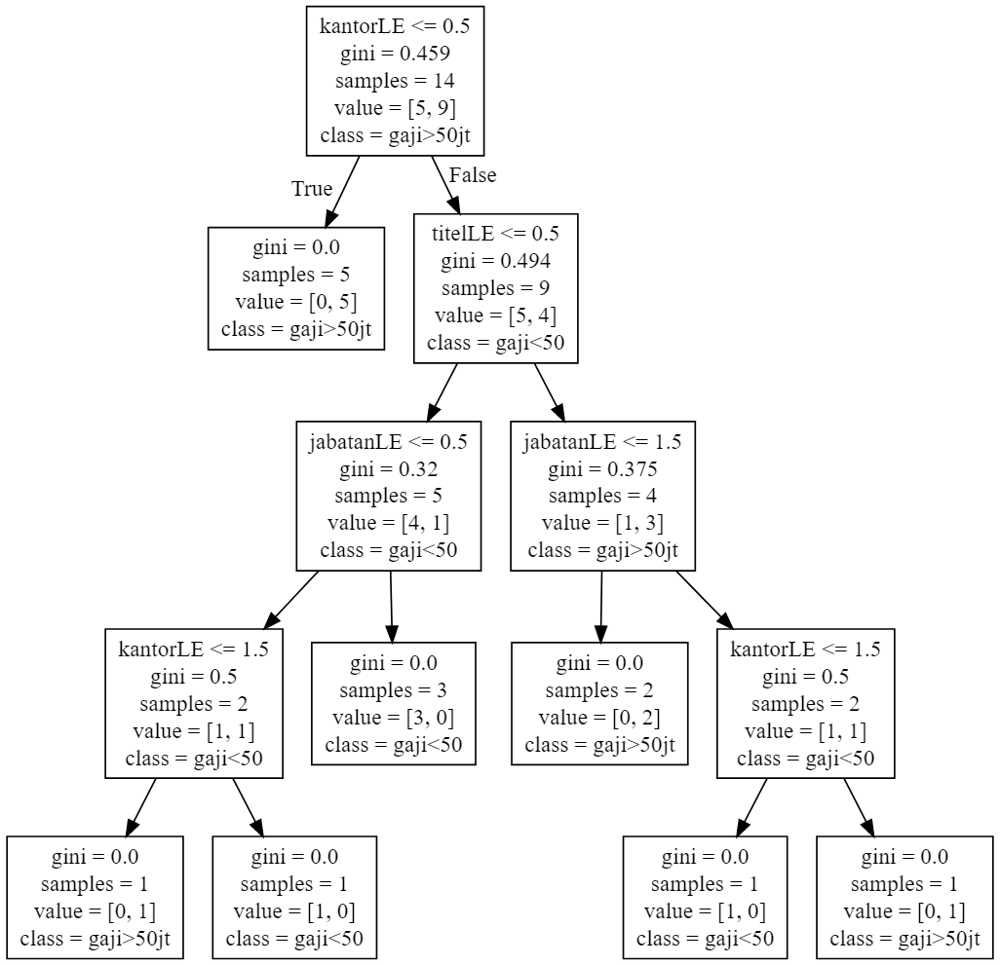
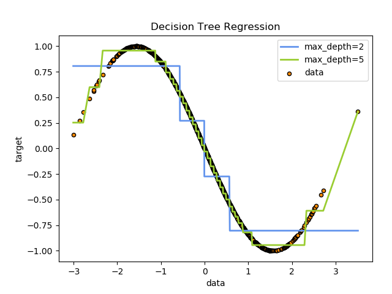

# Decision Tree Classifier & Regressor

## 1⃣ Decision Tree Classifier

```python
import pandas as pd
import numpy as np

# =================================
# load csv & create dataframe
df = pd.read_csv('0_data.csv')
# print(df)

# =================================
# convert nominal data => ordinal data
from sklearn.preprocessing import LabelEncoder

labelKantor = LabelEncoder()
df['kantorLE'] = labelKantor.fit_transform(df['kantor'])
labelJabatan = LabelEncoder()
df['jabatanLE'] = labelJabatan.fit_transform(df['jabatan'])
labelTitel = LabelEncoder()
df['titelLE'] = labelTitel.fit_transform(df['titel'])

df = df.drop(
    ['kantor', 'jabatan', 'titel'],
    axis = 'columns'    
)
# print(df)

# ===============================
# kantorLE    : 0 Facebook, 1 Google, 2 Tesla
# jabatanLE   : 0 GM, 1 Manager, 2 Staf
# titelLE     : 0 S1, 1 S2
# ===============================

# split: train 80% & test 20%
from sklearn.model_selection import train_test_split
x_train, x_tes, y_train, y_tes = train_test_split(
    df[['kantorLE', 'jabatanLE', 'titelLE']], 
    df['gaji>50'],
    test_size = .2,
    random_state = 1
)
print(x_train)
# print(len(x_tes))
print(y_train)
# print(len(y_tes))

# ===============================
# decision tree algo
from sklearn import tree
model = tree.DecisionTreeClassifier()

# train
model.fit(x_train, y_train)

# accuracy
acc = model.score(x_train, y_train)
print(acc * 100, '%')
acc2 = model.score(x_tes, y_tes)
print(acc2 * 100, '%')

# predict kantor, jabatan, titel
print(model.predict([[1, 1, 0]]))
print(model.predict([[1, 1, 1]]))
# print(model.predict([[1, 3, 0]]))

# draw the decision tree raph
# import decision tree graph as .dot file
tree.export_graphviz(
    model.fit(x_train, y_train), 
    out_file='4_drawTree.dot',
    feature_names=['kantorLE', 'jabatanLE', 'titelLE'],
    class_names=['gaji<50', 'gaji>50jt']
)
# go to https://dreampuf.github.io/GraphvizOnline 
# to convert the .dot to .png/.svg/image!
```



#

## 2⃣ Decision Tree Regressor

```python
import numpy as np
import pandas as pd

x = np.sort(np.random.randn(1000))
y = np.sin(-x)

import matplotlib.pyplot as plt
# plt.scatter(x, y)
# plt.show()

# Fit regression model
from sklearn.tree import DecisionTreeRegressor
regr_1 = DecisionTreeRegressor(max_depth=2)
regr_2 = DecisionTreeRegressor(max_depth=5)
regr_1.fit(x.reshape(-1,1), y)
regr_2.fit(x.reshape(-1,1), y)

# Predict
y_1 = regr_1.predict(x.reshape(-1,1))
y_2 = regr_2.predict(x.reshape(-1,1))

# Plot the results
plt.figure()
plt.scatter(x, y, s=20, edgecolor="black", c="darkorange", label="data")
plt.plot(x, y_1, color="cornflowerblue", label="max_depth=2", linewidth=2)
plt.plot(x, y_2, color="yellowgreen", label="max_depth=5", linewidth=2)
plt.xlabel("data")
plt.ylabel("target")
plt.title("Decision Tree Regression")
plt.legend()
plt.show()
```



#

#### Lintang Wisesa :love_letter: _lintangwisesa@ymail.com_

[Facebook](https://www.facebook.com/lintangbagus) | 
[Twitter](https://twitter.com/Lintang_Wisesa) |
[Google+](https://plus.google.com/u/0/+LintangWisesa1) |
[Youtube](https://www.youtube.com/user/lintangbagus) | 
:octocat: [GitHub](https://github.com/LintangWisesa) |
[Hackster](https://www.hackster.io/lintangwisesa)